<p align="center">
  
</p>

<p align="center">
  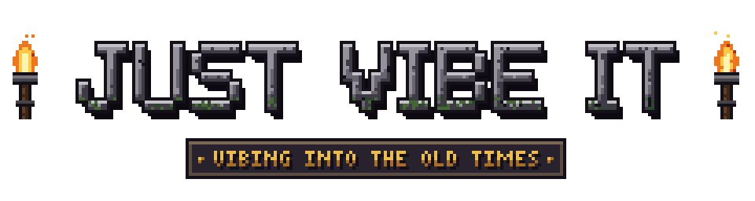
</p>

# Eye of the Beholder II - Vibemake

> **⚠️ Unofficial fan project — no connection to the rights holders.**
> It is not affiliated with, endorsed by, or approved by the creators or the current owners of
> *Eye of the Beholder*, nor by Wizards of the Coast. *Eye of the Beholder II: The Legend of
> Darkmoon*, *Advanced Dungeons & Dragons*, *Forgotten Realms* and all related marks belong to
> their respective owners.
>
> This is a non-commercial hobby project. Nothing here is for sale and there are no donations,
> ads or sponsorships of any kind. **Please buy the original game** — the
> *Eye of the Beholder* trilogy is sold on GOG as
> [Forgotten Realms: The Archives — Collection One](https://www.gog.com/en/game/forgotten_realms_the_archives_collection_one).
>
> **If a rights holder objects, tell me and I will take this repository and its releases down.**

A remake of **Eye of the Beholder II: The Legend of Darkmoon** (Westwood Associates / SSI,
1991) built in Godot 4.7 on top of the original game's data. It is the sequel to the
[Eye of the Beholder remake](https://github.com/OndrejKozacik/EOB1) and shares its engine.
The whole thing — the engine, the tools that dig through the original files, and this page —
was written in [Claude Code](https://claude.com/claude-code) by vibe coding.

The goal is fidelity first: the dungeon geometry, the AD&D rules, the level scripts, the
conversations, the monster behaviour and every string on screen are read straight out of the
original files, not re-invented. Where the remake adds something, it adds it around the
original rather than on top of it — and everything new can be switched off.

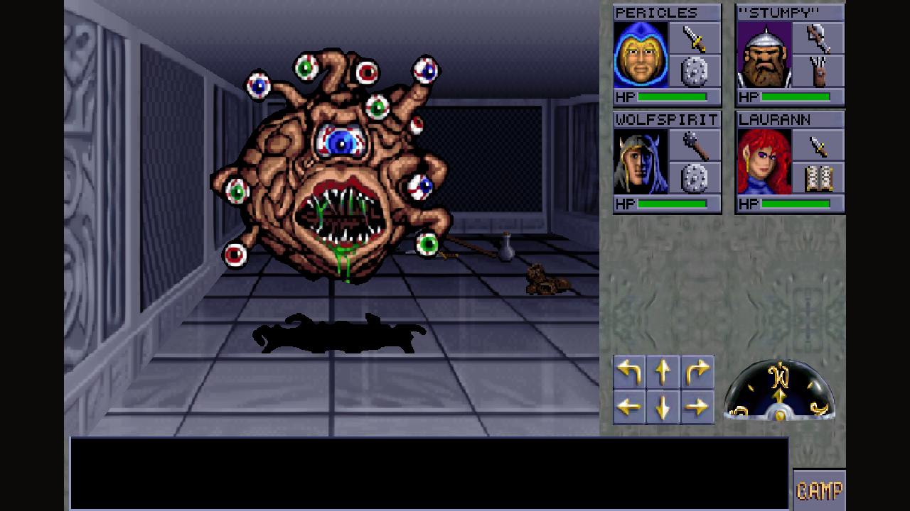

*The Silver Tower, a beholder blocking the corridor — upscaled artwork, wide layout.*

## Download

Grab the archive for your system from [Releases](../../releases). Everything the game
needs is inside it; nothing else has to be installed.

| | |
| --- | --- |
| **Windows** | `EOB2-windows-x64.zip` — unzip, run `Eye of the Beholder II.exe` |
| **Linux** | `EOB2-linux-x86_64.zip` — unzip, run `Eye of the Beholder II.x86_64`, keeping the `.pck` beside it |
| **macOS** | `EOB2-macos-universal.zip` — unzip, run `Eye of the Beholder II.app` (Intel and Apple Silicon) |

The Windows build has been started and checked. The Linux and macOS builds come from the same
source and the same data, but have not been started on those systems yet.

The macOS app is not signed or notarized, so the first launch is refused. Right-click the
app and choose *Open*, or clear the quarantine flag once with
`xattr -dr com.apple.quarantine "Eye of the Beholder II.app"`.

On Windows and Linux, saved games and settings go into a `save` folder next to the
executable, so the whole thing can live on a USB stick; if the game sits somewhere
read-only, such as `Program Files`, it falls back to the user profile instead. On macOS
they go into `~/Library/Application Support/`, because writing inside an `.app` bundle
would not survive replacing the app. The game has six save slots, as the original does.

## Bringing your party over from Eye of the Beholder

As in the original, *TRANSFER EOB I PARTY* in the main menu brings the heroes of the first
game along. Unzip this game into the same folder as the
[EOB1 remake](https://github.com/OndrejKozacik/EOB1) and it finds the party you saved
there; an original `EOBDATA.SAV` works too. Pick four of the six characters — they keep
their levels, their spells and the gear the original lets cross over.

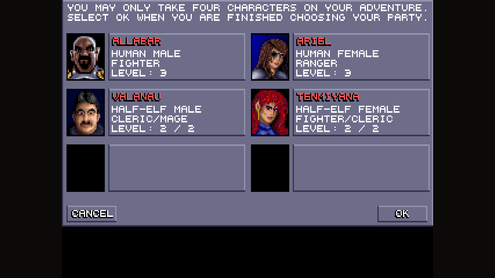

## Controls

| Key | Action |
| --- | --- |
| `↑` `↓`, `W` `S` | Step forward / back |
| `←` `→`, `A` `D` | Step sideways, as in the original |
| `Home` `PgUp`, `Q` `E` | Turn left / right |
| Mouse | Everything else — the interface is the original's: click the floor to pick things up, click a character's weapon to attack, click an answer in a conversation |
| Mouse wheel | Scroll back through the text window |
| `F1`–`F6` | Pick a character, as in the original; `Shift`+`F1`–`F6` swaps two characters |
| `I` | Inventory of the picked character; `P` switches to the character's statistics |
| `C`, `Esc` | Camp |
| `Tab`, `M` | Automap |
| `1`–`6`, `,` `.` `Space` | In the spellbook: spell level, previous / next spell, cast |
| `Ctrl`+`F2` / `Ctrl`+`F4` | Quick save / load in the current slot (`Alt` works too) |
| `Ctrl`+`F6` | Switch between the original artwork and the upscaled pack |
| `F7` | Switch between the wide layout and the original 320×200 one |
| `Alt`+`Enter` | Full screen on / off |
| `Alt`+`S` / `Alt`+`M` | Sounds / music on / off, as in the original |

The original uses the F keys for the characters, so the remake's own save, load and artwork
keys sit on `Ctrl` (or `Alt`). A save slot is chosen through the camp menu, as in the
original.

### On a Mac

A MacBook often has no F keys at all, and `Ctrl` shortcuts feel out of place there, so on
macOS the same actions also sit on `Cmd`:

| Key | Action |
| --- | --- |
| `Cmd`+`1`–`6` | Pick a character, same as `F1`–`F6`; `Shift`+`Cmd`+`1`–`6` swaps two characters |
| `Cmd`+`7` | Switch the layout, same as `F7` |
| `Cmd`+`S` / `Cmd`+`L` | Save / load game, same as `Ctrl`+`F2` / `Ctrl`+`F4` |
| `Cmd`+`G` | Switch between the original artwork and the upscaled pack, same as `Ctrl`+`F6` |
| `Ctrl`+`Cmd`+`F` | Full screen on / off (`Option`+`Return` works too) |
| `Option`+`S` / `Option`+`M` | Sounds / music on / off |

`Cmd`+`Q`, `Cmd`+`M`, `Cmd`+`H` and `Cmd`+`W` are left to macOS. Turning also works on `Q` / `E`,
so the missing `Home` and `PgUp` keys are not needed.

## Display settings

`Alt`+`Enter` switches full screen on and off at any time, menus included.

How the game starts is set in a small INI file next to the executable,
`Eye of the Beholder II.ini`. The game creates it on its first run with these values, which
keep the default of a 1280×720 window:

```ini
[Display]
; 1 = full screen, 0 = window
Fullscreen = 0
; 1 = maximized window (only when Fullscreen = 0)
MaximizeWindow = 0
; window size in pixels, e.g. 1280x720 or 1920x1080
; (only when Fullscreen = 0 and MaximizeWindow = 0)
Resolution = 1280x720
```

`Fullscreen` takes priority over `MaximizeWindow`, which in turn takes priority over
`Resolution`. A window larger than the screen is shrunk to fit, and a value the game cannot
read falls back to the default. `Alt`+`Enter` writes its choice into `Fullscreen`, so the next
start opens the same way.

On Windows and Linux the game also keeps an `override.cfg` beside the INI file. Godot reads it
before it opens the window, so the game starts straight in the chosen mode and size, splash
screen included. Edit the INI file, not that one; after editing the INI by hand, the first
start still switches once the game has loaded, and every start after that opens directly.
On macOS the INI file sits with the saved games in `~/Library/Application Support/`, and the
window switches once the game has loaded.

## What the original gives us

All sixteen levels — the catacombs, the forest around Darkmoon, the temple and its three
towers — with their walls, doors, pressure plates, levers, teleports, spinners, pits and
niches. The AD&D rules, experience tables, saving throws and spell effects are read from
`START.EXE`, so a cleric levels up exactly when the original says so. The level scripts run
through an interpreter of the original bytecode, which is what makes the puzzles, the
traps and the story behave the way they always did.

The people of Darkmoon talk as they did in 1991, in the original conversation window with
its pictures and answers — and some of them ask to join the party.

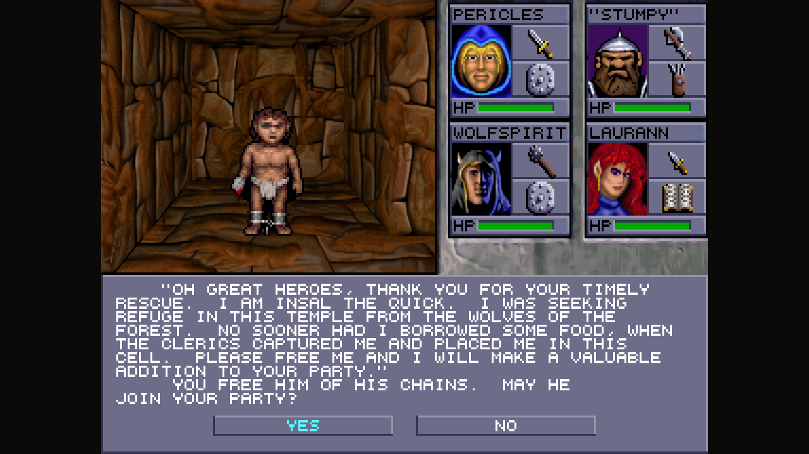

*Insal the Quick, chained in a cell below the temple, asks to join the party.*

Monsters move and fight in real time, spells work, items keep their original properties,
and the intro sequence, character creation, the camp and the ending in Dran's lair play out
from the original tables. Every piece of text in the game — menus, item names, the
conversations, the messages in the text window — comes out of the original files. Nothing
is retyped.

## What this remake adds

### Upscaled graphics

An optional art pack rendered through neural upscalers, with the wall pieces, monsters,
items and interface handled by different models and rules. Toggle it with `Ctrl`+`F6`; the
original artwork is always one keypress away and the two can be compared directly.

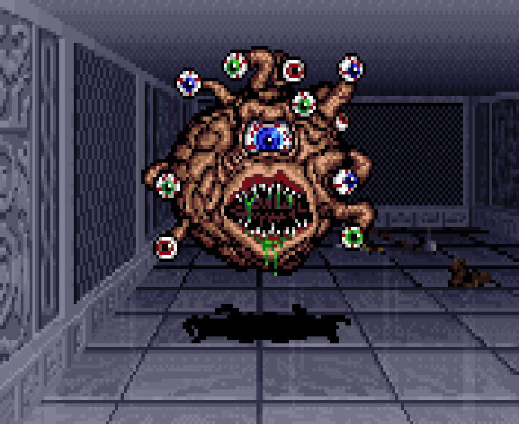

*The same beholder, the divider sweeping between the two: the original 320×200 artwork
simply enlarged, and the upscaled pack.*

### Wide layout

The original composes everything into 320×200. This layout keeps every panel pixel-exact
but rearranges them, giving the dungeon view most of the window and drawing a taller
message strip. Toggle it with `F7`; the original layout is always there.

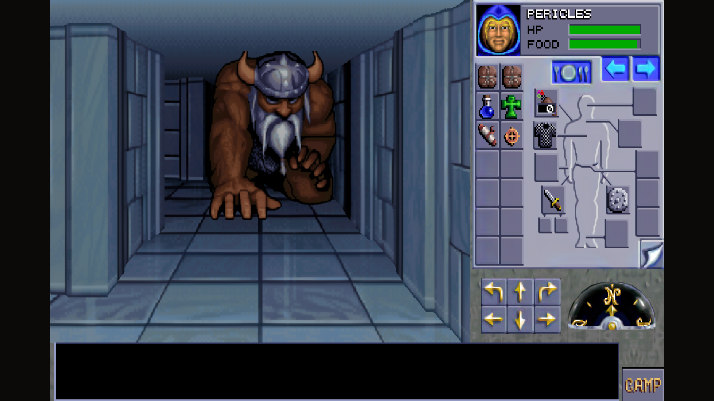

*The wide layout with an inventory open in the Azure Tower, a frost giant crouching in the
corridor ahead.*

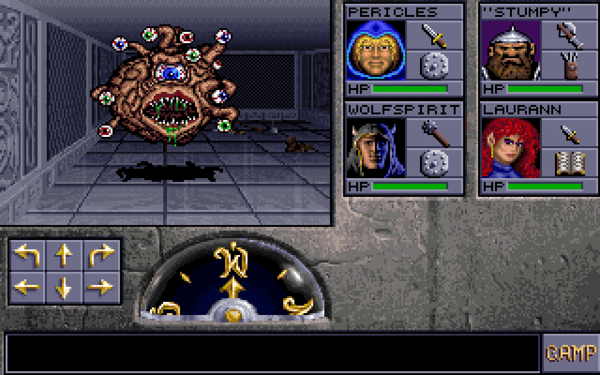

*The beholder from the top of the page, in the original 320×200 layout and artwork.*

### Automap from the Amiga AGA version

In 2006 CFou! rebuilt both games for the Amiga's AGA chipset and gave them something the PC
originals never had: an automap. It is carried over here one to one — the crumpled parchment,
the little icons, the Amiga font, the legend and the rules that decide what gets drawn,
right down to its quirks. Places such as Darkmoon, the tomb in the forest or the mantis nest
join the legend once the party has seen them, and typing C-F-O-U on the map switches on its
cheat mode, exactly as on the Amiga.

It is the default map: `Tab` or `M` opens it. The Lands of Lore map below is one click away
in *Camp → Preferences*, and both reveal the same squares, so switching never loses what the
party has already explored.

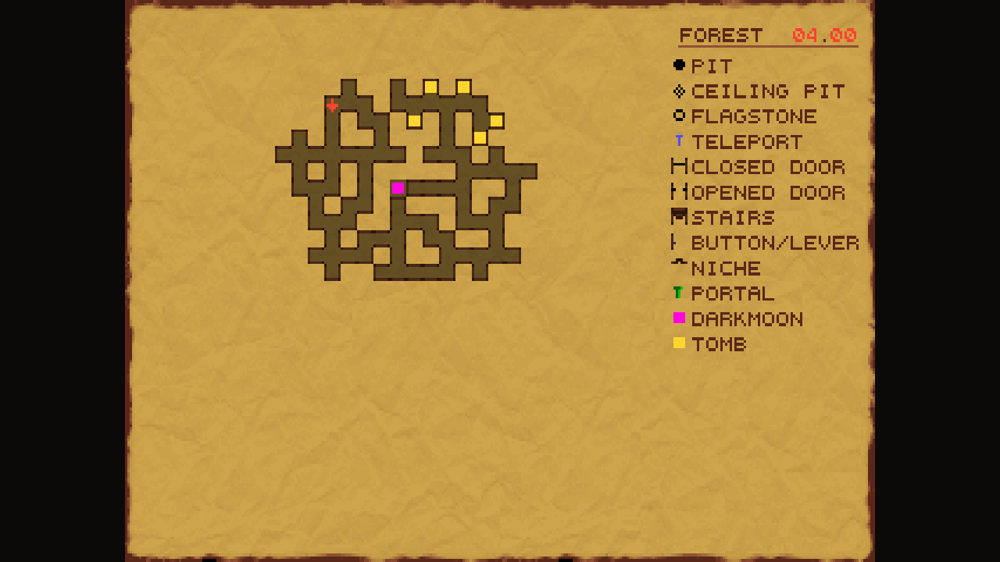

*The forest around Darkmoon part way through, with the temple and the tomb marked.*

### Lands of Lore automap

The original has no automap. The second map style is drawn with the marker artwork from
Westwood's *Lands of Lore* — doors, stairs, levers, keyholes, niches, pressure plates, pits,
teleports, portals and spinners each get their own mark, secret walls show up once the party
has walked through them, and every level is named after the part of Darkmoon it belongs to.
The arrows page through the levels the party has already visited.

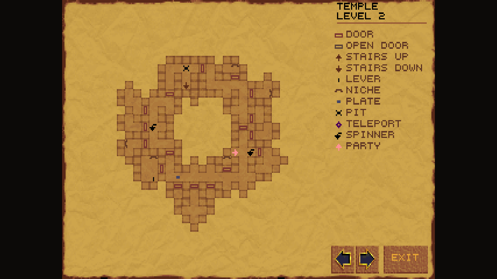

*The second level of the temple part way through: only what the party has walked is on the
parchment.*

### Sound

The original ships no samples, only AdLib instrument programs — ten banks of them, one for
each part of the game. Those are pre-rendered to WAV, so the game has its doors, its combat,
its spells and its music without an emulator running underneath. Sounds fade with distance
and share the original's channels and priorities, so a new sound cuts off or gives way to
the one already playing, the way the AdLib driver did it.

### A text window you can scroll

The text window keeps its history: roll the mouse wheel over it to read what scrolled away.
The original pads the window with empty lines every few steps; here the text stays
continuous.

### Auto-pickup of thrown weapons

A rock, dagger, spear or arrow returns to the character who threw it as soon as the party
steps on it — into the very slot it left from, or the belt if that slot has been refilled,
or the quiver in the case of ammunition. Anything the player puts down by hand is
deliberately left alone. Switch it off in *Camp → Preferences* if you want it strict.

### Quality of life

Quick save and load from the keyboard, a second line under "… taken." that tells what a
weapon or a piece of armour does and who can use it, and the display options remembered
between runs.

## More screenshots

| | |
| --- | --- |
| 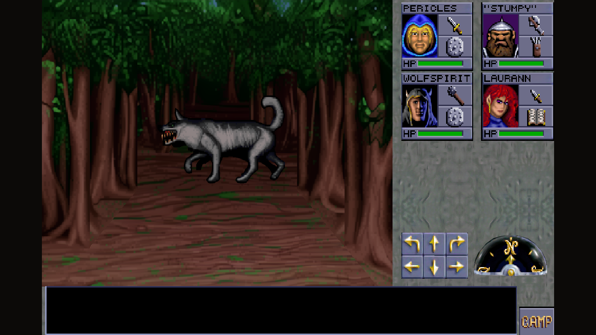 | 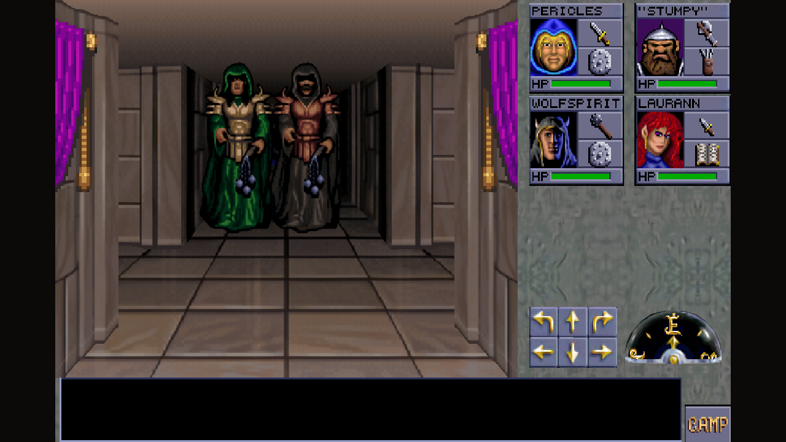 |
| *The forest around Darkmoon — a wolf on the path.* | *The temple — two of Darkmoon's clerics.* |
| 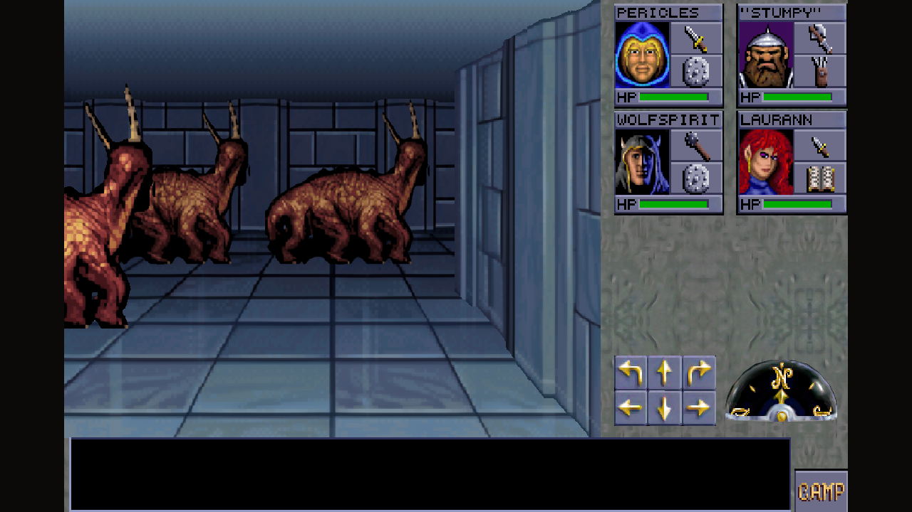 | 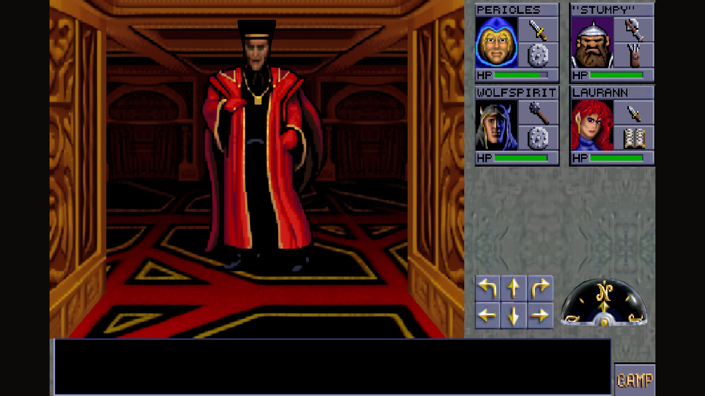 |
| *The Azure Tower — a pack of basilisks.* | *The Crimson Tower — Dran Draggore himself.* |

## What is missing

The manual copy-protection question of the original is skipped on purpose.

The game has been checked against `START.EXE` area by area, but nobody has played it from
the first step to the last yet — this is a release candidate, and reports are welcome in
[Issues](../../issues).

## Notes

The game data itself is not in this repository. The build is produced from a personal
copy of the original game, and the graphics, sounds and maps are baked into the package
at build time.

The Amiga automap is CFou!'s work from his Eye of the Beholder AGA releases (2006, giftware);
its parchment, icons and font are read from that release at build time.
